<div align="center">
  

  <h1>SnapKOBİ</h1>

  <p><strong>Esnafın AI İçerik Asistanı</strong></p>

  <p>
    Ürün fotoğrafını yükle — <em>saniyeler içinde</em> satışa hazır görsel, tanıtım videosu ve Türkçe pazarlama metni al.
  </p>

  <p>
    
    
    
    
    
  </p>

  <br/>

  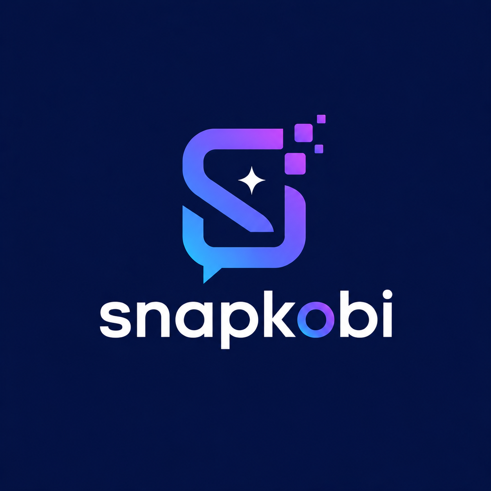
</div>

---

## 📋 İçindekiler

- [Nedir?](#-nedir)
- [Özellikler](#-özellikler)
- [Ekran Görüntüleri](#-ekran-görüntüleri)
- [Sistem Mimarisi](#-sistem-mimarisi)
- [Teknik Yığın](#-teknik-yığın)
- [Klasör Yapısı](#-klasör-yapısı)
- [Kurulum & Çalıştırma](#-kurulum--çalıştırma)
- [Ortam Değişkenleri](#-ortam-değişkenleri)
- [AI Pipeline](#-ai-pipeline)
- [Dağıtım](#-dağıtım)
- [Takım](#-takım)

---

## 🚀 Nedir?

Türkiye'de 3 milyonun üzerinde KOBİ ve esnaf, Instagram, Trendyol, WhatsApp Business gibi kanallarda rekabet edebilmek için profesyonel ürün içeriğine ihtiyaç duymaktadır. Ancak bu içeriği üretmek; fotoğrafçı maliyeti, teknik bilgi ve zaman gerektirmektedir.

**SnapKOBİ bu boşluğu kapatır:**

```
Sıradan telefon fotoğrafı  →  Profesyonel görsel + Tanıtım videosu + Türkçe metin
         (saniyeler içinde, sıfır teknik bilgi, sıfır maliyet)
```

---

## ✨ Özellikler

| Özellik | Açıklama |
|---------|----------|
| 🖼️ **AI Görsel Dönüşümü** | Ürün arka planı kaldırılır, AI stüdyo sahnesi oluşturulur, kompozit yapılır |
| 🎬 **Tanıtım Videosu** | 5 saniyelik hareketli ürün tanıtım videosu (Ken Burns efekti) |
| ✍️ **Platforma Özel Metin** | Instagram, Trendyol, WhatsApp, TikTok için ayrı Türkçe caption + hashtag |
| 📱 **Android & iOS** | Tek Flutter kod tabanı |
| 🌐 **Çevrimiçi Vitrin** | Trend şablonlar, topluluk gönderileri, hazır şablon kütüphanesi |
| 📂 **Proje Geçmişi** | Tüm üretimler kaydedilir, filtreli görüntülenir, tekrar paylaşılır |
| 🔒 **Güvenli** | JWT kimlik doğrulama, Supabase RLS, servis anahtarı yalnızca backend |
| 💰 **Ücretsiz AI Zincirleri** | Servis çökerse yedek devreye girer — çıktı hiç boş kalmaz |

---

## 📱 Ekran Görüntüleri

<div align="center">

### Açılış & Ana Sayfa
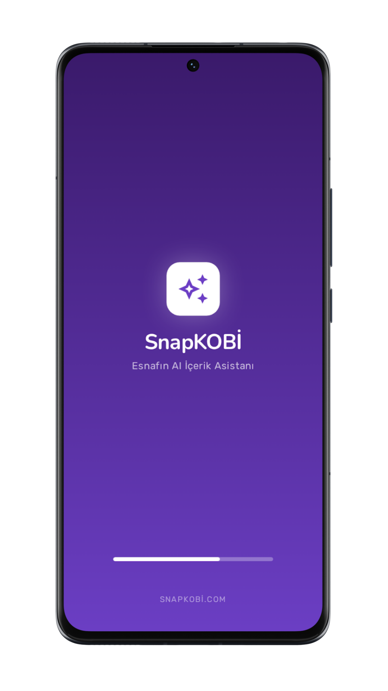
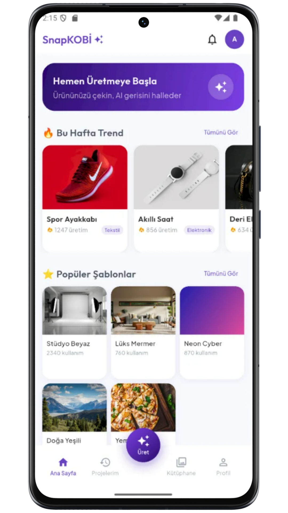
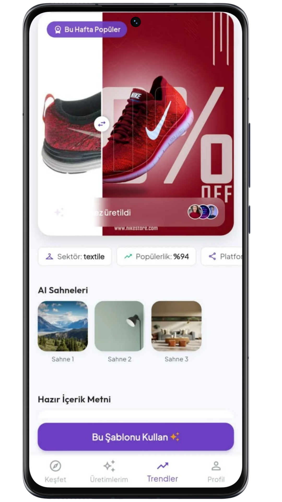

### Üretim Akışı
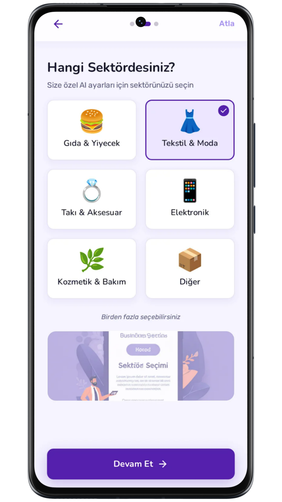
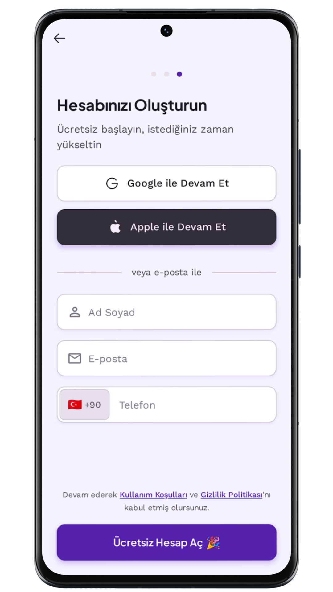
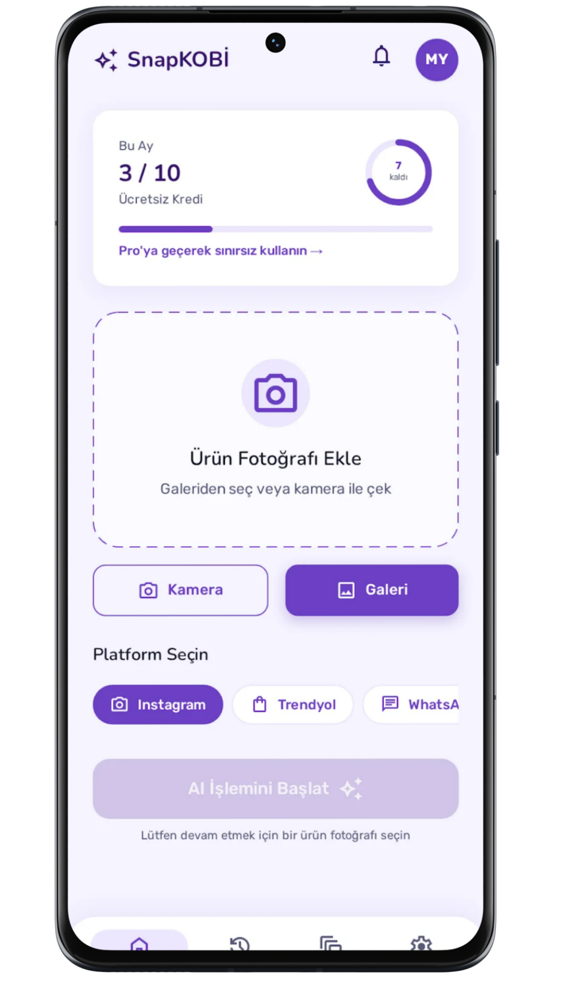

### Sonuçlar & Geçmiş
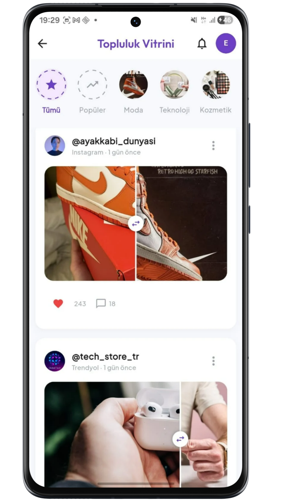
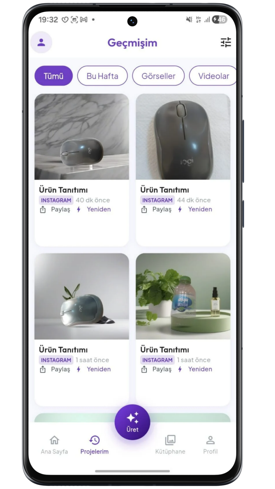


</div>

---

## 🏗️ Sistem Mimarisi

<div align="center">
  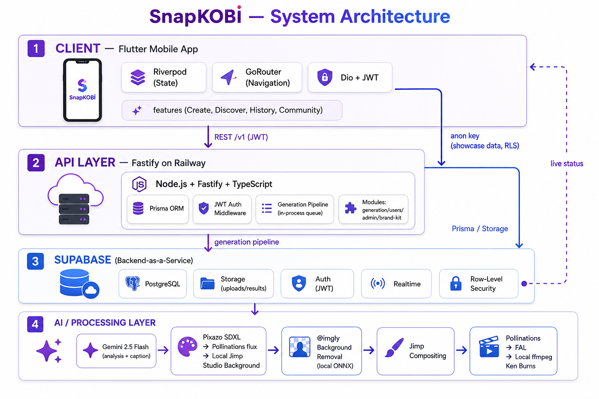
  <p><em>Şekil 1 — Genel Sistem Mimarisi (4 katman)</em></p>
</div>

```
┌─────────────────────────────────────────────────────────┐
│          Flutter (Android/iOS)                           │
│   Riverpod · GoRouter · Dio+JWT · Supabase SDK          │
└──────────────┬──────────────────────────┬───────────────┘
               │ REST /v1/*               │ anon key (vitrin)
               ▼                          ▼
┌──────────────────────┐    ┌─────────────────────────────┐
│  Fastify API (Railway)│    │        Supabase (BaaS)       │
│  Node.js · Prisma     │◄──►│  PostgreSQL · Storage       │
│  Generation Pipeline  │    │  Auth · Realtime · RLS      │
└──────────────┬────────┘    └─────────────────────────────┘
               │ AI pipeline
               ▼
┌─────────────────────────────────────────────────────────┐
│                  AI / İşleme Katmanı                     │
│  Gemini 2.5 Flash  →  Pixazo SDXL / Pollinations flux   │
│  @imgly (kesim)  →  Jimp (kompozit)  →  ffmpeg (video)  │
└─────────────────────────────────────────────────────────┘
```

<div align="center">
  
  <p><em>Şekil 2 — AI Üretim Pipeline Akışı</em></p>
  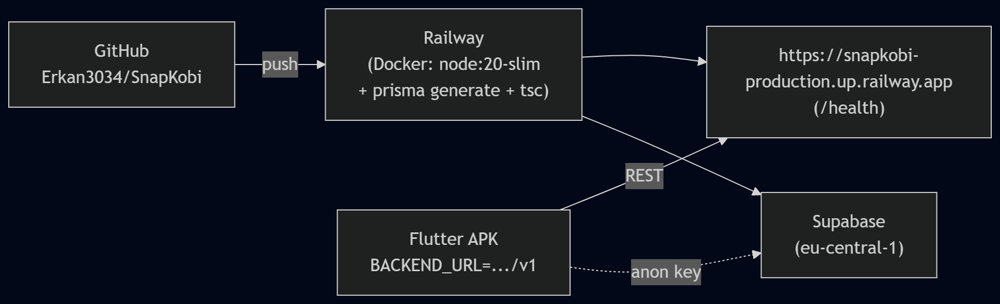
  <p><em>Şekil 3 — Dağıtım Topolojisi</em></p>
</div>

---

## 🛠️ Teknik Yığın

### Mobil (Flutter)
| Paket | Kullanım |
|-------|----------|
| `flutter_riverpod` | Durum yönetimi |
| `go_router` | Sayfa yönlendirme |
| `dio` | HTTP istemci + JWT interceptor |
| `supabase_flutter` | Veritabanı, auth, realtime |
| `flutter_dotenv` | Ortam değişkenleri (.env) |
| `flutter_launcher_icons` | Uygulama ikonu |

### Backend (Node.js)
| Paket | Kullanım |
|-------|----------|
| `fastify` | Web framework |
| `prisma` | ORM (PostgreSQL) |
| `@google/generative-ai` | Gemini analiz + caption |
| `@imgly/background-removal-node` | Yerel ONNX arka plan kesimi |
| `jimp` | Görsel kompozit + gölge |
| `ffmpeg-static` | Yerel video üretimi |
| `heic-convert` | iPhone HEIC → JPEG dönüşümü |
| `zod` | Şema doğrulama |

---

## 📁 Klasör Yapısı

```
SnapKobi/  (monorepo)
├── SnapKOBI/                  # Flutter mobil uygulama
│   ├── lib/
│   │   ├── core/              # Tema, sabitler, ağ, DI
│   │   ├── features/          # Ekran ekran özellikler
│   │   │   ├── discover/      # Ana sayfa
│   │   │   ├── create/        # Üretim formu
│   │   │   ├── generation/    # İşleniyor + Sonuç
│   │   │   ├── history/       # Geçmiş + detay
│   │   │   ├── community/     # Topluluk vitrini
│   │   │   ├── library/       # Şablon kütüphanesi
│   │   │   ├── trend/         # Trendler
│   │   │   ├── auth/          # Giriş / kayıt
│   │   │   └── settings/      # Profil / ayarlar
│   │   ├── domain/            # Entities, usecases, repo arayüzleri
│   │   ├── data/              # Datasources, models, repo impl.
│   │   └── shared/            # Ortak widget'lar, navigasyon
│   ├── assets/icon/           # Logo kaynakları
│   └── .env                   # SUPABASE_URL, BACKEND_URL
│
├── snapkobi-backend/          # Node.js / Fastify API
│   ├── src/
│   │   ├── modules/           # generation, users, admin...
│   │   └── ai/
│   │       ├── pipeline/      # pipeline.orchestrator.ts
│   │       └── providers/     # Gemini, Pixazo, Pollinations, ffmpeg...
│   ├── prisma/schema.prisma   # Veritabanı şeması
│   └── Dockerfile             # Railway dağıtım imajı
│
└── supabase/                  # SQL kurulum dosyaları (RLS + seed)
```

---

## ⚡ Kurulum & Çalıştırma

### Gereksinimler
- Node.js 20+
- Flutter 3.8+
- Supabase hesabı

### 1. Depoyu klonla
```bash
git clone https://github.com/Erkan3034/SnapKobi.git
cd SnapKobi
```

### 2. Backend
```bash
cd snapkobi-backend
npm install
npm run prisma:generate
# .env dosyasını oluştur (aşağıya bakın)
npm run dev          # → http://localhost:3000
```

### 3. Veritabanı kurulumu
Supabase SQL Editor'de sırayla çalıştırın:
```
supabase/SETUP_SHOWCASE_FULL.sql
supabase/SETUP_BACKGROUND_THEMES.sql
```

### 4. Flutter
```bash
cd SnapKOBI
flutter pub get
flutter run --release
# APK üretmek:
flutter build apk --release
```

---

## 🔑 Ortam Değişkenleri

### `snapkobi-backend/.env`
```dotenv
DATABASE_URL=postgresql://...@pooler.supabase.com:6543/postgres?pgbouncer=true
DIRECT_DATABASE_URL=postgresql://...@supabase.com:5432/postgres
SUPABASE_URL=https://<ref>.supabase.co
SUPABASE_ANON_KEY=<anon_key>
SUPABASE_SERVICE_ROLE_KEY=<service_role_key>
GOOGLE_AI_API_KEY=<gemini_key>       # ZORUNLU
GEMINI_MODEL=gemini-2.5-flash
PIXAZO_API_KEY=<pixazo_key>          # Opsiyonel (SDXL arka plan)
POLLINATIONS_KEY=<key>               # Opsiyonel (fallback)
PORT=3000
NODE_ENV=development
```

### `SnapKOBI/.env`
```dotenv
SUPABASE_URL=https://<ref>.supabase.co
SUPABASE_ANON_KEY=<anon_key>
BACKEND_URL=https://snapkobi-production.up.railway.app/v1
```

---

## 🤖 AI Pipeline

```
Fotoğraf yükleme
    │
    ▼
0) Gemini 2.5 Flash       → ürün analizi (tür, renk, kategori)
    │
    ▼
1a) downscale 1440px      → bellek optimizasyonu
1b) @imgly (ONNX)         → arka plan kaldırma (yerel, ücretsiz)
1c) AI Arka Plan Zinciri:
    Pixazo SDXL  →  Pollinations flux  →  Yerel Jimp stüdyo
1d) Jimp kompozit         → ürün + arka plan + temas gölgesi
    │
    ├──────────────────────────────────────┐
    ▼                                      ▼
2) Caption + Hashtag                3) Tanıtım Videosu
   Gemini 2.5 Flash                    Pollinations → FAL → ffmpeg
   (OpenAI fallback)                   Ken Burns efekti (yerel)
    │                                      │
    └──────────────┬───────────────────────┘
                   ▼
         generations → status=completed
         Flutter Realtime → Sonuç ekranı
```

> **Tasarım ilkesi:** Her adımın ücretsiz yerel yedeği vardır. Dış servis çökse bile görsel ve video **her koşulda** üretilir.

---

<div align="center">
  <sub>SnapKOBİ · Esnafın AI İçerik Asistanı</sub>
</div>
