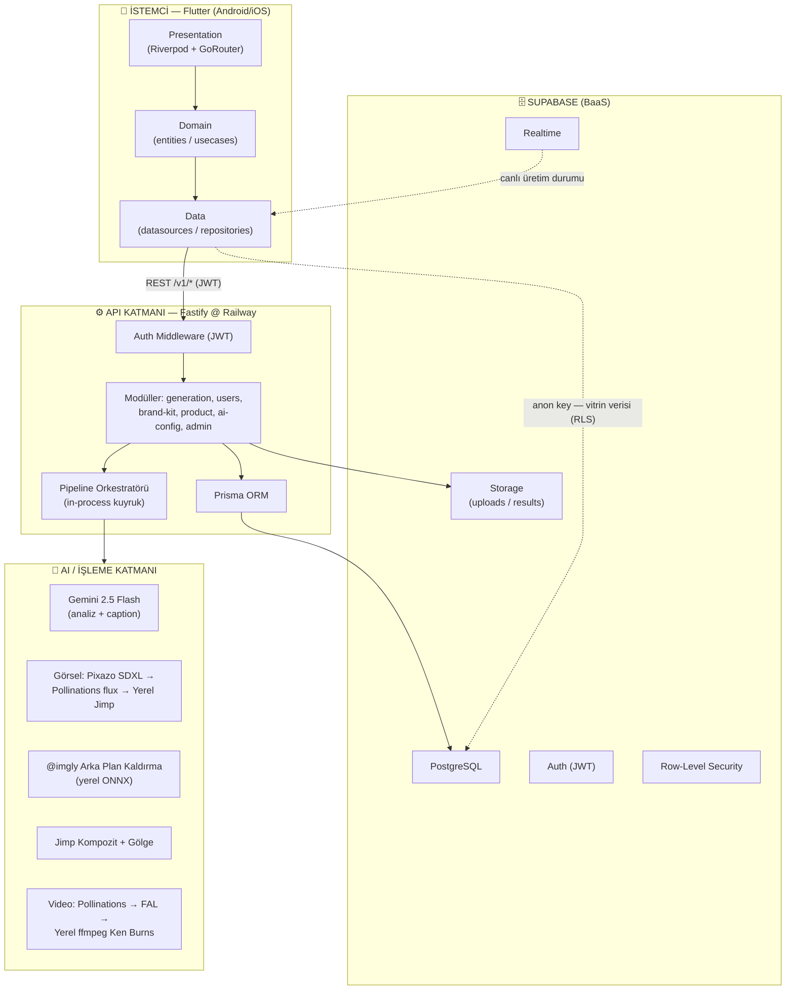
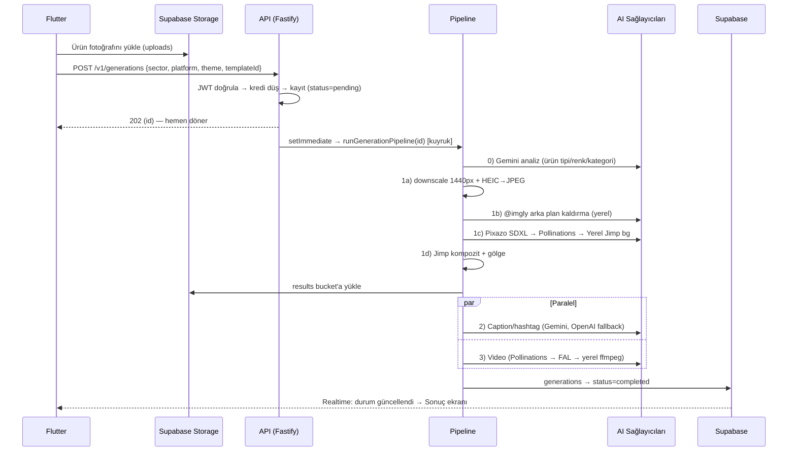
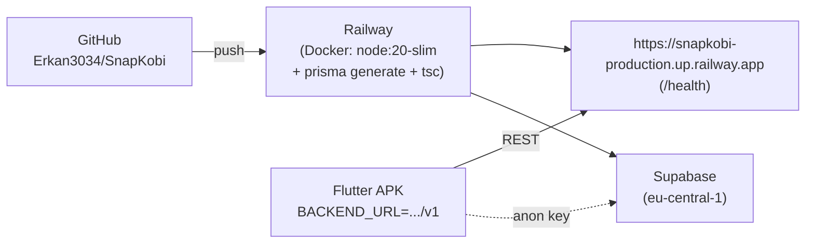

# 🏗️ SnapKOBİ — Sistem Mimarisi

> KOBİ'lerin ürün fotoğrafını **yapay zekâ** ile paylaşıma hazır **görsel + 5 sn tanıtım videosu + platforma özel caption/hashtag**'e dönüştüren mobil uygulamanın uçtan uca mimari dokümanı.

---

## İçindekiler
1. [Genel Bakış](#1-genel-bakış)
2. [Yüksek Seviye Mimari](#2-yüksek-seviye-mimari)
3. [Katmanlar](#3-katmanlar)
4. [Çekirdek Akış — Üretim Pipeline'ı](#4-çekirdek-akış--üretim-pipelineı)
5. [Teknoloji Yığını](#5-teknoloji-yığını)
6. [Veri Modeli](#6-veri-modeli)
7. [Dağıtım Topolojisi](#7-dağıtım-topolojisi)
8. [Kesişen Konular](#8-kesişen-konular-cross-cutting)
9. [Ek: Mimari Görseli için AI Prompt](#9-ek-mimari-görseli-için-ai-üretim-promptu)

---

## 1. Genel Bakış

SnapKOBİ **3 katmanlı, bulut tabanlı** bir sistemdir ve üretim tamamen **ücretsiz + fallback'li AI sağlayıcı zincirleriyle** çalışır — yani görsel ve video hiçbir koşulda boş kalmaz.

| Parça | Sorumluluk | Konum |
|-------|------------|-------|
| **Flutter App** | Mobil arayüz, kullanıcı akışı | `SnapKOBI/` |
| **Fastify Backend** | İş mantığı, AI pipeline orkestrasyonu | `snapkobi-backend/` |
| **Supabase** | Veritabanı, depolama, kimlik, realtime | Managed (eu-central-1) |
| **AI Sağlayıcıları** | Analiz, görsel, kesim, caption, video | HTTP + yerel |

---

## 2. Yüksek Seviye Mimari

---

## 3. Katmanlar

### 3.1 İstemci — Flutter
- **Mimari:** Feature-first + Clean-ish katmanlama.
  `presentation` (ekran/widget) → `domain` (`entities`, `usecases`, `repositories` arayüzleri) → `data` (`datasources/remote`, `models`, `repositories_impl`).
- **State yönetimi:** Riverpod (`StateNotifier` / `Notifier` / `AsyncNotifier`). Her feature'da `*_provider.dart`.
- **Navigasyon:** GoRouter — tüm rotalar `shared/navigation/app_routes_list.dart`. Alt menü 4 sekme (Ana Sayfa, Projelerim, Kütüphane, Profil) + ortada **"Üret"** FAB (`main_scaffold.dart`).
- **İki veri yolu:**
  - **(A) Backend REST** (Dio + `auth_interceptor` JWT): üretim başlatma, geçmiş, kullanıcı/marka.
  - **(B) Supabase doğrudan** (anon key): vitrin verisi (`trends`, `community_posts`, `admin_templates`, `background_themes`) — RLS ile public read.
- **Özellikler:** `auth`, `discover`, `create`, `generation` (processing/result), `history`, `community`, `library`, `trend`, `subscription`, `settings`, `onboarding`, `splash`.

### 3.2 API — Fastify (Railway)
- **Yapı:** modül başına `*.routes.ts` / `*.controller.ts` / `*.schema.ts` (Zod ile doğrulama).
- **Güvenlik:** `auth.middleware` (Supabase JWT doğrular), `@fastify/cors`, `@fastify/rate-limit`.
- **ORM:** Prisma → Supabase PostgreSQL (transaction pooler `:6543`).
- **Üretim tetikleme:** `generation.controller` → kredi kontrolü (`app_settings.credit_rules`) → `$transaction` (kredi düş + kayıt oluştur) → `setImmediate` ile **arka planda** `runGenerationPipeline(id)` → istek hemen döner (non-blocking).
- **Eşzamanlılık:** pipeline **in-process kuyruk** ile serileştirilir (aynı anda tek ağır iş → OOM koruması).

### 3.3 Veri — Supabase
- **PostgreSQL** (şema kaynağı: `prisma/schema.prisma`, `prisma db push`).
- **Storage:** `uploads` (orijinal foto), `results` (üretilen görsel/video) — signed URL (~24 sa).
- **Auth:** JWT; backend doğrular, Flutter token taşır.
- **Realtime:** Flutter, `generations` satırını dinleyerek üretim durumunu canlı izler.
- **RLS:** vitrin tabloları `anon`/`authenticated` için yalnızca `is_active=true` satırlara public read; yazma `service_role` (backend).

### 3.4 AI / İşleme
Her adımın **ücretsiz bir yerel/fallback alternatifi** vardır (detay §4).

---

## 4. Çekirdek Akış — Üretim Pipeline'ı

> En kritik akış. `snapkobi-backend/src/ai/pipeline/pipeline.orchestrator.ts`

**Tasarım ilkesi:** Hiçbir adım tek bir dış servise bağımlı değildir; her zinciri yerel bir alternatif kapatır → **görsel ve video her koşulda üretilir.**

---

## 5. Teknoloji Yığını

| Katman | Teknolojiler |
|--------|--------------|
| **Mobil** | Flutter, Riverpod, GoRouter, Dio, supabase_flutter, flutter_dotenv |
| **Backend** | Node.js 20, Fastify, TypeScript, Prisma, Zod |
| **Veri** | Supabase: PostgreSQL, Storage, Auth, Realtime, RLS |
| **AI** | Gemini 2.5 Flash, Pixazo SDXL, Pollinations (flux), @imgly/background-removal (ONNX), Jimp, ffmpeg-static, heic-convert |
| **Dağıtım** | Railway (Docker), Supabase (managed), GitHub (push→auto-deploy) |

---

## 6. Veri Modeli (özet)

| Tablo | Amaç |
|-------|------|
| `users` | Kullanıcı profili, kredi, plan, sektör |
| `brand_kits` | Marka rengi/tonu (üretim bağlamı) |
| `generations` | Üretim kayıtları (durum, görsel/video/caption path) |
| `ai_configs` | Görev başına aktif AI model/sağlayıcı ayarı |
| `app_settings` | Kredi kuralları vb. konfigürasyon |
| `trends` | Vitrin: trend şablonları |
| `community_posts` | Vitrin: topluluk önce/sonra gönderileri |
| `admin_templates` | Vitrin/Kütüphane: hazır şablonlar (prompt override) |
| `background_themes` | Create ekranı arka plan temaları |

---

## 7. Dağıtım Topolojisi

- Backend **kalıcı** olarak Railway'de (ngrok artık kullanılmıyor).
- GitHub'a push → Railway otomatik yeniden deploy.
- Docker imajı `libgomp1` içerir (onnxruntime/@imgly için şart).

---

## 8. Kesişen Konular (Cross-Cutting)

- **Dayanıklılık:** AI sağlayıcı fallback zincirleri (görsel & video) + yerel alternatifler.
- **Performans / bellek:** girdi görseli işleme öncesi 1440px'e küçültülür; pipeline tek-iş kuyruğuyla serileştirilir → **OOM koruması**.
- **Güvenlik:** Backend JWT doğrulama; Supabase doğrudan okumada RLS; `service_role` anahtarı yalnız backend'de.
- **Hata yönetimi:** `AppNetworkImage` (boş/kırık/süresi dolmuş görsel → placeholder), `Result` tipi, `Promise.allSettled` (caption ve video birbirini bloklamaz).
- **Görsel kalite:** HEIC normalizasyonu, "no-text" prompt, marka/kişi adı uydurmama kuralları.

---

