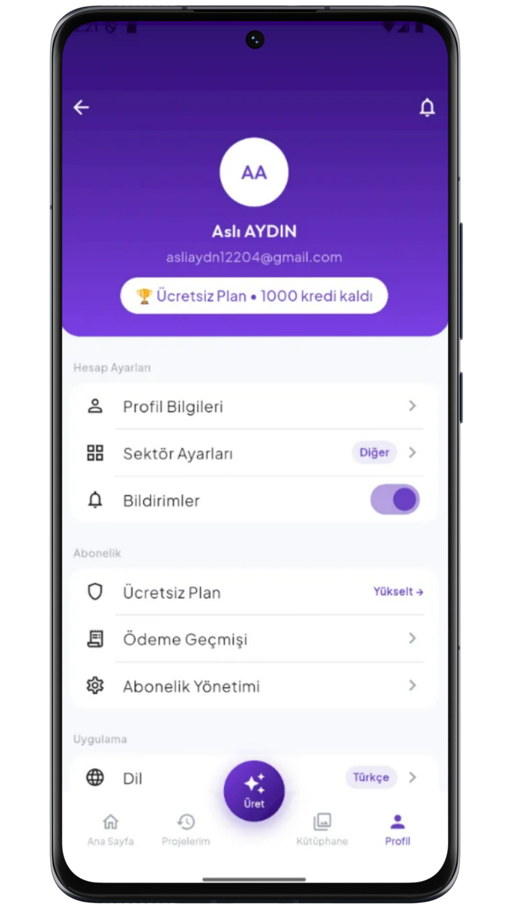
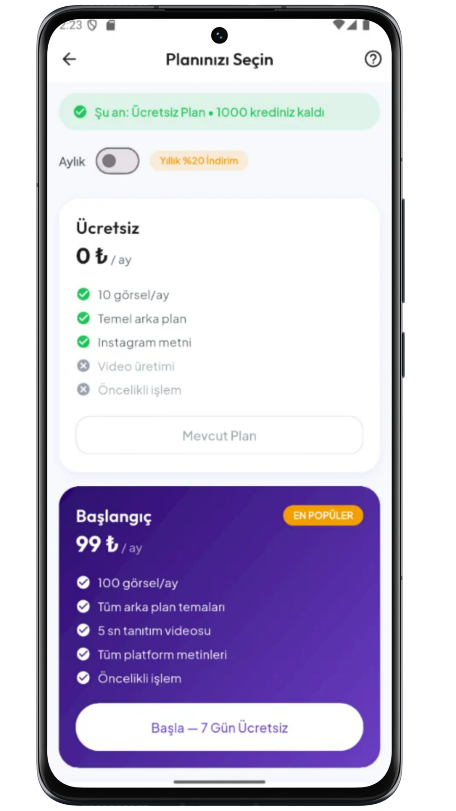

<div align="center">
  

  <h1>SnapKOBİ — Flutter</h1>
  <p><strong>Esnafın AI İçerik Asistanı · Mobil Uygulama</strong></p>

  <p>
    
    
    
    
    
    
  </p>
</div>

---

## 📱 Uygulama Hakkında

SnapKOBİ Flutter uygulaması; KOBİ sahiplerinin ürün fotoğrafını yükleyip yapay zekâ ile **profesyonel satış görsellerine**, **5 saniyelik tanıtım videolarına** ve **platforma özel Türkçe pazarlama metinlerine** dönüştürmesini sağlayan mobil istemcidir.

- **Android & iOS** desteği (tek kod tabanı)
- **Feature-first + Clean-ish** mimari
- **Riverpod** ile reaktif durum yönetimi
- **GoRouter** ile tip-güvenli navigasyon
- **Supabase Realtime** ile canlı üretim durumu

---

## 🖼️ Ekranlar

<div align="center">


|  |  |  |


|  |  |  |


|  |  |  |

</div>

---

## 🏛️ Mimari

### Katman Yapısı

```
lib/
├── main.dart              # Uygulama girişi (Supabase init, router)
│
├── core/                  # Uygulama geneli yardımcılar
│   ├── theme/             # Renkler, tipografi, açık/koyu tema
│   │   ├── app_colors.dart
│   │   ├── app_typography.dart
│   │   ├── app_theme_light.dart
│   │   └── app_theme_dark.dart
│   ├── constants/         # API URL, uygulama sabitleri
│   ├── network/           # Dio istemci + JWT auth interceptor
│   ├── di/                # Bağımlılık enjeksiyonu (providers)
│   └── utils/             # Yardımcı fonksiyonlar, logger
│
├── features/              # Her özellik kendi klasöründe
│   ├── auth/              # Giriş, kayıt, şifremi unuttum
│   ├── onboarding/        # İlk açılış akışı + sektör seçimi
│   ├── splash/            # Splash ekranı
│   ├── discover/          # Ana sayfa (trend + şablon + topluluk)
│   ├── create/            # Üretim formu (foto + platform + tema)
│   ├── generation/        # İşleniyor ve sonuç ekranları
│   │   ├── processing/
│   │   └── result/
│   ├── history/           # Geçmiş projeler + detay
│   ├── community/         # Topluluk vitrini + gönderi detayı
│   ├── library/           # Şablon kütüphanesi + arama/filtre
│   ├── trend/             # Trendler + trend detay
│   ├── subscription/      # Plan/abonelik ekranı
│   └── settings/          # Profil, ayarlar, yardım
│
├── domain/                # Saf iş mantığı (framework bağımsız)
│   ├── entities/          # Generation, User, Template vb.
│   ├── usecases/          # İş kuralları
│   └── repositories/      # Soyut repository arayüzleri
│
├── data/                  # Veri katmanı implementasyonları
│   ├── datasources/remote/  # Supabase + REST datasource'lar
│   ├── models/              # JSON serileştirme modelleri
│   └── repositories_impl/  # Repository implementasyonları
│
└── shared/                # Tüm özellikler arası paylaşılan
    ├── navigation/        # GoRouter rotaları (app_routes_list.dart)
    └── widgets/           # AppNetworkImage, BeforeAfterSlider vb.
```

### Veri Akışı

```
UI (Screen)
  │  ref.watch(provider)
  ▼
Provider (Riverpod Notifier)
  │  repository.metot()
  ▼
Repository Impl
  ├──► Dio (REST → backend /v1/*)      ← üretim, geçmiş, kullanıcı
  └──► Supabase SDK (anon key)         ← vitrin verisi (trends, community...)
```

---

## 🧩 Temel Bileşenler

### Durum Yönetimi (Riverpod)

Her özelliğin kendi `*_provider.dart` dosyası vardır:

```dart
// Örnek: üretim formunun durumu
final createProvider = NotifierProvider<CreateNotifier, CreateState>(
  CreateNotifier.new,
);

// Widget içinde kullanımı:
final state = ref.watch(createProvider);         // dinle
ref.read(createProvider.notifier).setImagePath(path); // değiştir
```

### Navigasyon (GoRouter)

Tüm rotalar `lib/shared/navigation/app_routes_list.dart` dosyasındadır:

```dart
// Rota sabitleri: lib/shared/navigation/routes.dart
context.push(AppRoutes.create);                    // basit geçiş
context.push(AppRoutes.communityDetail, extra: item); // veri taşıma
context.go(AppRoutes.home);                        // geçmişi temizle
```

### Backend İletişimi (Dio)

```dart
// lib/core/network/dio_client.dart
// Her isteğe otomatik JWT eklenir:
// Authorization: Bearer <supabase_access_token>
```

### Görsel Güvenliği

```dart
// lib/shared/widgets/image/app_network_image.dart
// Boş/geçersiz URL'de crash yerine placeholder gösterir
AppNetworkImage(url: imageUrl, width: 200, height: 200)
```

---

## ⚙️ Kurulum

### Gereksinimler

| Araç | Sürüm |
|------|-------|
| Flutter | 3.8+ |
| Dart | 3.x |
| Android SDK | API 21+ |

### Adımlar

```bash
# 1. Bağımlılıkları yükle
flutter pub get

# 2. Launcher ikonlarını üret (gerekirse)
dart run flutter_launcher_icons

# 3. Uygulamayı çalıştır
flutter run                   # debug (emülatör veya USB cihaz)
flutter run --release         # release (Railway backend'e bağlı)

# 4. APK üret
flutter build apk --release
# Çıktı: build/app/outputs/flutter-apk/app-release.apk
```

---

## 🔑 Ortam Değişkenleri (`.env`)

Proje kökünde `.env` dosyası oluşturun:

```dotenv
SUPABASE_URL=https://<ref>.supabase.co
SUPABASE_ANON_KEY=<anon_public_key>
BACKEND_URL=https://snapkobi-production.up.railway.app/v1
AUTH_REDIRECT_URL=snapkobi://auth-callback/
```

> `.env` dosyası `pubspec.yaml`'da asset olarak tanımlıdır — APK'ya gömülür ve `--dart-define` olmadan da çalışır.

### Backend URL öncelik sırası

```
1) --dart-define=BACKEND_URL=...   (derleme zamanı — en güvenli)
2) .env içindeki BACKEND_URL       (APK'ya gömülü)
3) Platform varsayılanı             (yalnızca debug)
   - Android emülatör: http://10.0.2.2:3000/v1
   - iOS: http://localhost:3000/v1
```

---

## 📦 Başlıca Paketler

```yaml
dependencies:
  flutter_riverpod     # Durum yönetimi
  go_router            # Navigasyon
  supabase_flutter     # Supabase (DB + Auth + Realtime)
  dio                  # HTTP istemci
  flutter_dotenv       # .env desteği
  url_launcher         # Video/link açma
  image_picker         # Galeri/kamera seçimi

dev_dependencies:
  flutter_launcher_icons  # Uygulama ikonu üretimi
  build_runner            # Kod üretimi
  json_serializable       # JSON model üretimi
```

---

## 🗺️ Ekran & Rota Haritası

| Rota | Ekran | Açıklama |
|------|-------|----------|
| `/` | `SplashScreen` | Açılış, oturum kontrolü |
| `/onboarding` | `OnboardingScreen` | İlk kullanıcı karşılama |
| `/login` | `LoginScreen` | E-posta ile giriş |
| `/register` | `RegisterScreen` | Kayıt |
| `/home` | `MainScaffold` | Alt menü iskeleti (4 sekme) |
| `/create` | `CreateScreen` | Üretim formu |
| `/processing` | `ProcessingScreen` | AI işlem durumu |
| `/results` | `ResultScreen` | Görsel + video + caption |
| `/history` | `HistoryScreen` | Geçmiş projeler |
| `/project-detail` | `ProjectDetailScreen` | Proje detayı |
| `/community-showcase` | `CommunityScreen` | Topluluk vitrini |
| `/community-detail` | `CommunityDetailScreen` | Gönderi detayı + tam ekran |
| `/library` | `LibraryScreen` | Şablon kütüphanesi |
| `/template-detail` | `TemplateDetailScreen` | Şablon detayı |
| `/trending` | `TrendingScreen` | Trendler |
| `/trend-details` | `TrendDetailsScreen` | Trend detayı |
| `/subscription` | `SubscriptionScreen` | Plan & abonelik |
| `/settings` | `SettingsScreen` | Profil & ayarlar |

---

## 🎨 Tema Sistemi

```dart
// Marka renkleri: lib/core/theme/app_colors.dart
static const Color primary         = Color(0xFF6C3FC5);  // Ana mor
static const Color primaryDark     = Color(0xFF2D0E6E);  // Koyu mor
static const Color primaryMid      = Color(0xFF5C2DB8);  // Orta mor
static const Color primaryLight    = Color(0xFF7B3FE4);  // Açık mor
static const Color primaryLightest = Color(0xFFF3E8FF);  // En açık

// Tema dosyaları:
// lib/core/theme/app_theme_light.dart  → açık tema
// lib/core/theme/app_theme_dark.dart   → koyu tema
```

---

## 🔗 İlgili

- [Backend README](../snapkobi-backend/README.md) — API, AI pipeline, ngrok, Railway kurulumu
- [Mimari Dokümanı](ARCHITECTURE.md) — Detaylı sistem diyagramları

---

<div align="center">
  <sub>SnapKOBİ Flutter · <a href="https://github.com/Erkan3034/SnapKobi">github.com/Erkan3034/SnapKobi</a></sub>
</div>
